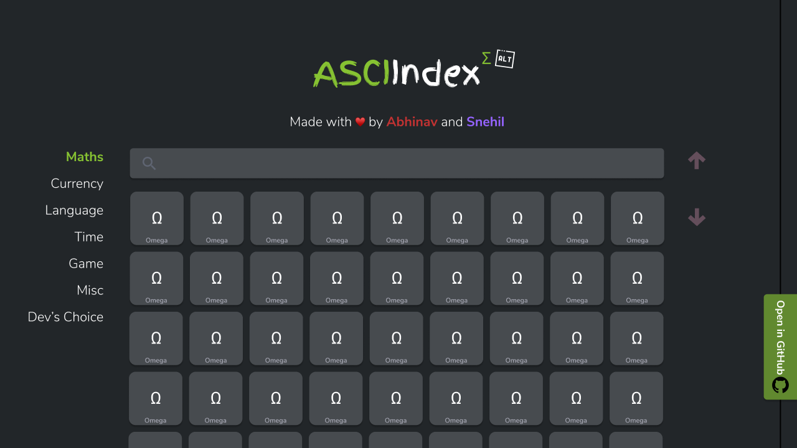

<!-- ## Available Scripts

In the project directory, you can run:

### `npm start`

Runs the app in the development mode.<br />
Open [http://localhost:3000](http://localhost:3000) to view it in the browser.

The page will reload if you make edits.<br />
You will also see any lint errors in the console.

### `npm test`

Launches the test runner in the interactive watch mode.<br />
See the section about [running tests](https://facebook.github.io/create-react-app/docs/running-tests) for more information.

### `npm run build`

Builds the app for production to the `build` folder.<br />
It correctly bundles React in production mode and optimizes the build for the best performance.

The build is minified and the filenames include the hashes.<br />
Your app is ready to be deployed!

See the section about [deployment](https://facebook.github.io/create-react-app/docs/deployment) for more information.

### `npm run eject`

**Note: this is a one-way operation. Once you `eject`, you can’t go back!**

If you aren’t satisfied with the build tool and configuration choices, you can `eject` at any time. This command will remove the single build dependency from your project.

Instead, it will copy all the configuration files and the transitive dependencies (webpack, Babel, ESLint, etc) right into your project so you have full control over them. All of the commands except `eject` will still work, but they will point to the copied scripts so you can tweak them. At this point you’re on your own.

You don’t have to ever use `eject`. The curated feature set is suitable for small and middle deployments, and you shouldn’t feel obligated to use this feature. However we understand that this tool wouldn’t be useful if you couldn’t customize it when you are ready for it.

## Learn More

You can learn more in the [Create React App documentation](https://facebook.github.io/create-react-app/docs/getting-started).

To learn React, check out the [React documentation](https://reactjs.org/).

### Code Splitting

This section has moved here: https://facebook.github.io/create-react-app/docs/code-splitting

### Analyzing the Bundle Size

This section has moved here: https://facebook.github.io/create-react-app/docs/analyzing-the-bundle-size

### Making a Progressive Web App

This section has moved here: https://facebook.github.io/create-react-app/docs/making-a-progressive-web-app

### Advanced Configuration

This section has moved here: https://facebook.github.io/create-react-app/docs/advanced-configuration

### Deployment

This section has moved here: https://facebook.github.io/create-react-app/docs/deployment

### `npm run build` fails to minify

This section has moved here: https://facebook.github.io/create-react-app/docs/troubleshooting#npm-run-build-fails-to-minify -->

<p align="center">
  <a href="https://github.com/01Abhinav/ASCIIndex">
    
  </a>

  <h2 align="center">Find special ASCII characters with ease</h2>
  <p align="center">
    A react webapp that helps you work with special unicode symbols!
    <br />
    Made with ❤ by <a href="https://github.com/01Abhinav/"><strong>Abhinav</strong></a> and <a href="https://github.com/sneakysensei"><strong>Snehil</strong></a>.
    <br />
    <br />
    <a href="#">Explore Website</a>
    ·
    <a href="https://github.com/01Abhinav/ASCIIndex/issues">Report Bug</a>
    ·
    <a href="https://github.com/01Abhinav/ASCIIndex/issues">Request Feature</a>
  </p>
</p>

<p align="center">
  <a href="https://github.com/01Abhinav/ASCIIndex/graphs/contributors"></a>
  <a href="https://github.com/01Abhinav/ASCIIndex/blob/master/LICENSE"></a>
</p>

<!-- TABLE OF CONTENTS -->

## Table of Contents

- [About the Project](#about-the-project)
  - [Built With](#built-with)
- [Setting up development environment](#setting-up-development-environment)
- [Contributing](#contributing)
- [License](#license)
- [Contact](#contact)
- [Acknowledgements](#acknowledgements)

<!-- ABOUT THE PROJECT -->

## About The Project

[](img/screenshot.png)

<!-- There are many great README templates available on GitHub, however, I didn't find one that really suit my needs so I created this enhanced one. I want to create a README template so amazing that it'll be the last one you ever need.

Here's why:
* Your time should be focused on creating something amazing. A project that solves a problem and helps others
* You shouldn't be doing the same tasks over and over like creating a README from scratch
* You should element DRY principles to the rest of your life :smile:

Of course, no one template will serve all projects since your needs may be different. So I'll be adding more in the near future. You may also suggest changes by forking this repo and creating a pull request or opening an issue.

A list of commonly used resources that I find helpful are listed in the acknowledgements. -->

### Built With

This list can grow as development continues.

- [ReactJs](https://reactjs.org/)
- [styled-components](https://styled-components.com/)
- [JSS](https://cssinjs.org/)

<!-- GETTING STARTED -->

## Setting up development environment

In order to test this webapp locally, you need to download the required npm packages and start the react server. Follow these steps if you don't know how.

### Install NPM packages

```sh
npm install
```

### Starting the Reactjs local server

```sh
npm start
```

<!-- CONTRIBUTING -->

## Contributing

Contributions are what make the open source community such an amazing place to be learn, inspire, and create. Any contributions you make are **greatly appreciated**.

1. Fork the Project
2. Create your Feature Branch (`git checkout -b feature/AmazingFeature`)
3. Commit your Changes (`git commit -m 'Add some AmazingFeature'`)
4. Push to the Branch (`git push origin feature/AmazingFeature`)
5. Open a Pull Request

<!-- LICENSE -->

## License

Distributed under the MIT License. See `LICENSE` for more information.

<!-- CONTACT -->

## Contact the Devs

#### Abhinav Raj

[](https://www.linkedin.com/in/abhinav-raj-77252918a/) [](https://github.com/01Abhinav/)

#### Snehil

[](https://www.linkedin.com/in/snehilcodes/) [](https://github.com/SneakySensei/)

<!-- ACKNOWLEDGEMENTS -->

## Acknowledgements

<!-- - [GitHub Emoji Cheat Sheet](https://www.webpagefx.com/tools/emoji-cheat-sheet)
- [Img Shields](https://shields.io)
- [Choose an Open Source License](https://choosealicense.com)
- [GitHub Pages](https://pages.github.com)
- [Animate.css](https://daneden.github.io/animate.css)
- [Loaders.css](https://connoratherton.com/loaders)
- [Slick Carousel](https://kenwheeler.github.io/slick)
- [Smooth Scroll](https://github.com/cferdinandi/smooth-scroll)
- [Sticky Kit](http://leafo.net/sticky-kit)
- [JVectorMap](http://jvectormap.com)
- [Font Awesome](https://fontawesome.com) -->
